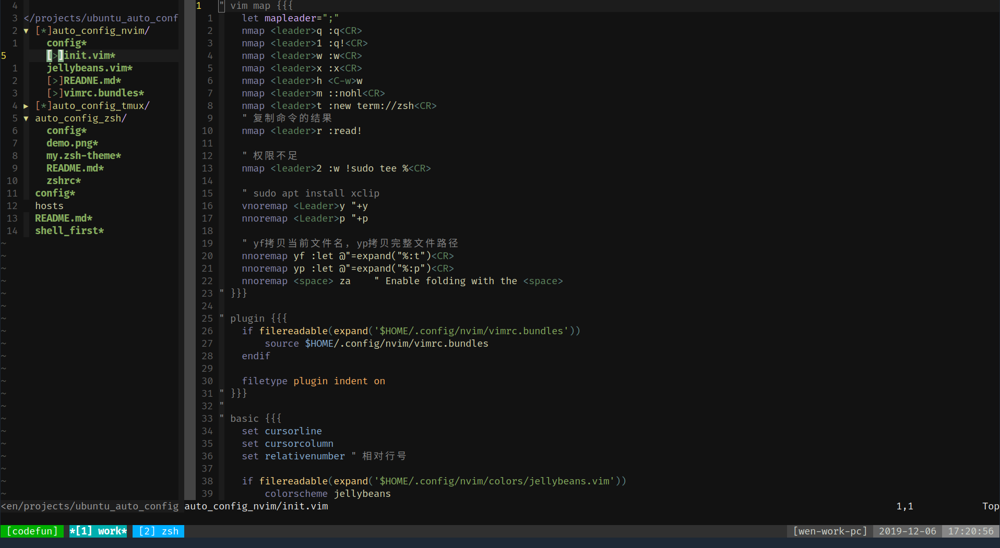

重装系统之后，vim的安装是没有问题的，但是那个神级的插件 YouCompleteMe 死活都不能成功安装，没办法，只能只一个替代品。

然后发现了 nvim 更发现了[ncm2](https://github.com/ncm2/ncm2) 现在做一个简单的试用。


nvim: vim的替代品，看起开比vim似乎更好用一些，先配置着，反正也兼容所有的vim操作，兼容大部分vim的插件。

**主要针对Python开发的进行的配置**

所有Python HOST 指定的是[Pyenv](https://suadminwen.github.io/2019/08/24/pyenv%E7%9A%84%E4%BD%BF%E7%94%A8%E5%92%8C%E9%97%AE%E9%A2%98%E8%A7%A3%E5%86%B3/)的neovim2和neovim3

```
# 安装pyenv

pyenv virtualenv 2.7.15 neovim2
pyenv virtualenv 3.6.6 neovim3

# 配置neovim2环境
pyenv activate neovim2
pip install neovim jedi yarp python-language-server
pyenv deactivate

# 配置neovim3环境
pyenv activate neovim3
pip install neovim jedi yarp python-language-server
pyenv deactivate
```

vim 教程
========

## 安装与配置

`bash config`



## 自定义的快捷键

快捷主键： `;`

- `;` + `s`：`:w<Enter>`，保存
- `;` + `q`：`:q<Enter>`，退出
- `;` + `1`：`:q!<Enter>`，不保存退出
- `;` + `w`: `<Ctr>ww`，窗口切换
- `;` + `m`：`:noml`，取消高亮
- `;` + `y`：``，复制到系统剪切板
- `;` + `p`：``，从系统剪切板粘贴到当前光标之后
- `;` + `s`：`:Gblame`，查看当前文件的git log，需要插件支持
- `F2`：打开目录树
- `F12`：跳转到函数定义的处

## vim的使用简单说明

**vim的几种模式**

- 正常模式：使用快捷键命令，或者输入`:`输入命令，例如`:w` 保存当前文档
- 插入模式：可以输入文本，从正常模式可以通过键入`i`、`a`、`s`、`o`等进入插入模式
- 可视模式：正常模式下按`v`、`V`或`Ctrl+v`都可以进入可视模式，在可视模式下，可以选择文本
- 替换模式：正常模式下，按`R`进入替换模式，按`ESC`退出

除了以上几种之外，还有一些特殊的情况，当初学者依照其他编辑器按下`Ctrl+s`的时候，发现可爱的光标就不见了踪影，这是因为进入了隐藏模式，此时所有输入在后台输入，但是还是有效的，如果输入`Ctrl+q`则会退出，会看到刚刚慌乱的时候输入的文本。

正确的vim入门方式时**停止输入的时候就按按`ESC`，保持在正常模式下**，等待输入命令，或移动光标。

### 最基础的入门


正常模式下的基础命令：

- `hjkl`：上下左右移动光标。

优先掌握的最最基础的命令，使用vim其实就该摒弃`← ↓ ↑ →`，因为在不间断的输入的快感中，突然将右手移至右下角是一件多么不爽的事情，所以要让旁人看起来我很忙的样子就是不停的按下入`hjkl`让光标狂躁起来！

- `i`：插入模式，按`ESC`回到正常模式。

最最最基础的命令，在当前光标所在的位置进行插入，与其对应的时`a`，

- `a`：插入模式，按`ESC`回到正常模式。

`a`命令与 `i`的最大区别就是`a`在当前光标所在的位置之后进行插入。这也是它们唯一的差别。还有一个与它们也是及其相似那就是`s`命令，这个是将光标所在的字符删除并开始插入。

- `x`：删当前光标所在的一个字符。

前面既然说到了`s`那么就不能不说`x`命令啦，这个呢完成了`s`的前半部分，那么这样理解`s`就可以了：按下`s`等同与按下了`xi`，看看一个顶俩，厉害！

- `dd`：删除当前行，并把删除的行存到剪贴板里。

前面说到的时一个字符一个字符的删除，有点不爽，那么`dd`就厉害了，一下子删除了一行，当然这个删除的一行也不会别浪费，暂时存到了剪贴版里面，如果你按下`p`命令，就会发现在光标所在行的下一行，刚刚删除的这行文本又回来了！

- `p`：粘贴剪贴板。

`p`的功能在前面已经提到了，就是将剪切板的内容在光标之后粘贴。

- `:wq`：保存并退出。

捣鼓了半天，不能让自己的努力白费，那就需要这个命令，`:w`保存，`:q`退出。连接起来就可以一起输入`:wq`。这个命令执行之后，可以看到作下角会出现输入的命令，然后按下`Enter`即可完成保存和退出。

以上说到的这些命令是Vim的最最基础的命令，知道这些命令，最起码能够在Vim能编辑文本了，依旧是能够苟活下去了。下一步就是学会一些自我感觉良好的命令。

### 感觉良好

**各种插入：**

- `a`：在光标后插入
- `s`：删除光标下的字符并在光标前插入
- `i`：在当前光标前插入
- `I`：在行首插入
- `o`：在当前行下面插入新行
- `O`：在当前行上面插入新行
- `cw`：替换当前光标下单词到词尾的字符

**光标移动：**

- `0`：移动光标到行头
- `^`：移动光标到行首不为空白字符位置，空白字符包括空格、制表符、换行符等
- `$`：移动光标到行尾
- `g_`：移动光标到本行最后一个不是空白字符的位置
- `/pattern`：搜索 pattern 的字符串（如果搜索出多个匹配，可按n键到下一个）
- `w`：先前移动一个单词
- `b`：向后移动一个单词
- `e`：移动到当前单词末尾
- `W`：向后移动一个大单词，忽略掉单词间的分隔符
- `B`：向前移动一个大单词，忽略掉单词间的分隔符
- `*`：匹配光标当前所在的单词，移动光标到下一个匹配单词
- `#`：匹配光标当前所在的单词，移动光标到上一个匹配单词
- `%`：匹配括号移动，包括 (, {, [

**复制粘贴：**

- `y`：复制当前光标下的字符
- `yy`：复制当前行
- `p`：粘贴
- `P`：

**撤销：**

- `u`：undo
- `U`：
- `<Ctr>r`：redo
